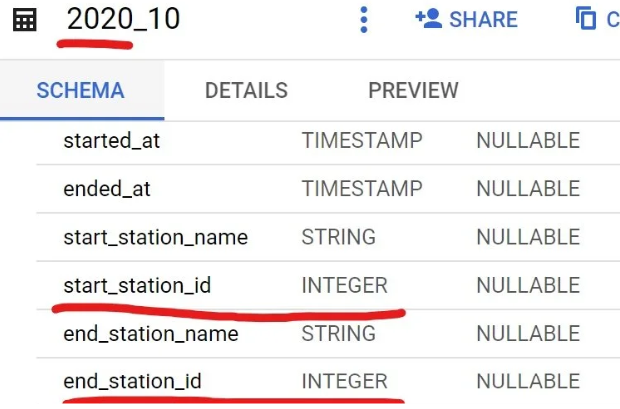
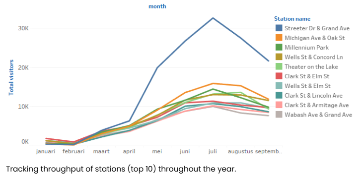
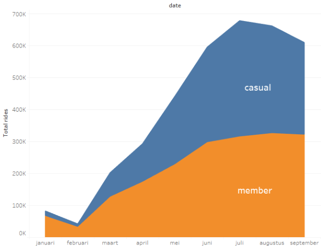
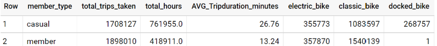
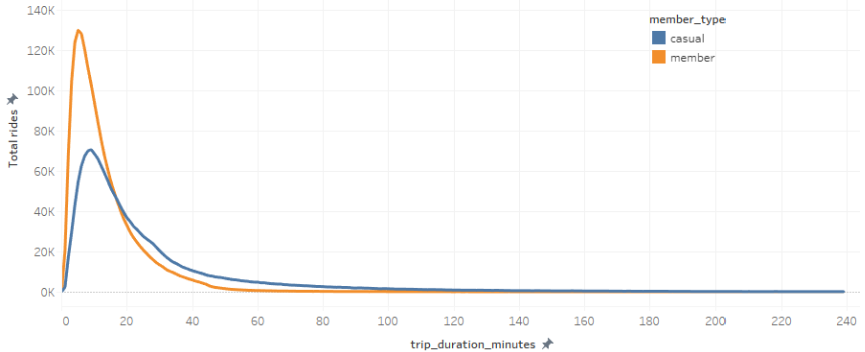
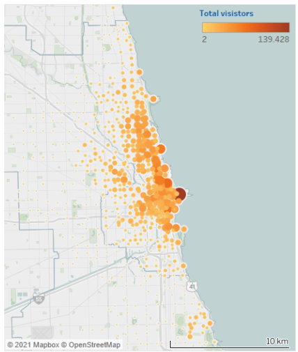

# Case Study: Cyclist

An analysis of 12 months of Chicago bike-share trip data, looking for behavioural differences between casual riders and members that could help convert more casual riders into members.

**Tools:** Google BigQuery (Standard SQL) · Tableau Desktop · Jupyter Notebook

---

## Prepare

### Gathering the data

The data for this analysis comes from a public dataset collected and provided by the City of Chicago\*: a trips dataset of more than 21 million data points (trips), tracking 13 variables.

We limit the analysis to the past 12 months, October 2020 through September 2021, since this is the timeframe most relevant to our question.

Checking the metadata that comes with the dataset, we find this note:

> "Divvy Bicycle Stations and Divvy Trips are complete with no data loss we are aware of, but there are two important notes.
>
> The station latitude and longitude values for Divvy trips that occurred during the gap in data (approximately 7/7/2019 to 12/9/2019) have been assigned based on the stations' locations as of 12/9/2019. In some cases, these stations may have been elsewhere at the time of the trip.
>
> The new Divvy feed does not include the value used for the Address column in Divvy Bicycle Stations. That column is now blank and will be removed in early 2020. Please make any necessary changes to processes that use this dataset.
>
> As anticipated, there is a permanent gap in the Divvy Bicycle Stations – Historical data between 7/7/2019 and 12/9/2019. As with the Divvy Bicycle Stations dataset, the Address column is blank for records after this gap. However, we are keeping the column in the dataset to preserve previous values.
>
> Update 2/11/2020: We have removed the Address column, as described above."

Our window starts well after this gap, so none of it affects us.

## Process

The 12 months of data we want are spread across 12 tables. We start by merging everything into a single table so we don't have to repeat the cleaning process 12 times. For the merge to work, the tables first need to share a single format:

- table dimensions (width)
- column names
- column data types

Checking the schemas, we find that `start_station_id` and `end_station_id` are of type INTEGER in the 2020 tables, while the same columns in 2021 are STRING.



Running the query below on each 2020 table casts the IDs to STRING, so all tables end up in the same format, ready for merging:

```sql
SELECT
  ride_id,
  rideable_type,
  CAST(started_at AS TIMESTAMP) AS started_at,
  CAST(ended_at AS TIMESTAMP) AS ended_at,
  start_station_name,
  CAST(start_station_id AS STRING) AS start_station_id,
  end_station_name,
  CAST(end_station_id AS STRING) AS end_station_id,
  start_lat,
  start_lng,
  end_lat,
  end_lng,
  member_casual
FROM
  `capstone-case1.Cyclist_trip_data.2020_10`
```

Then we merge all the tables into one, named `12_months`. Using UNION DISTINCT here has a nice side effect: any exact duplicate rows get dropped during the merge.

```sql
CREATE TABLE
  `capstone-case1.Cyclist_trip_data.12_months` AS (
  SELECT * FROM `capstone-case1.Cyclist_trip_data.2020_10_corrected`
  UNION DISTINCT
  SELECT * FROM `capstone-case1.Cyclist_trip_data.2020_11_corrected`
  UNION DISTINCT
  SELECT * FROM `capstone-case1.Cyclist_trip_data.2020_12_corrected`
  UNION DISTINCT
  SELECT * FROM `capstone-case1.Cyclist_trip_data.2021_01`
  UNION DISTINCT
  SELECT * FROM `capstone-case1.Cyclist_trip_data.2021_02`
  UNION DISTINCT
  SELECT * FROM `capstone-case1.Cyclist_trip_data.2021_03`
  UNION DISTINCT
  SELECT * FROM `capstone-case1.Cyclist_trip_data.2021_04`
  UNION DISTINCT
  SELECT * FROM `capstone-case1.Cyclist_trip_data.2021_05`
  UNION DISTINCT
  SELECT * FROM `capstone-case1.Cyclist_trip_data.2021_06`
  UNION DISTINCT
  SELECT * FROM `capstone-case1.Cyclist_trip_data.2021_07`
  UNION DISTINCT
  SELECT * FROM `capstone-case1.Cyclist_trip_data.2021_08`
  UNION DISTINCT
  SELECT * FROM `capstone-case1.Cyclist_trip_data.2021_09` );
```

To finish cleaning, we work through the following tasks:

1. Trim leading and trailing whitespace
2. Remove irrelevant variables, create new more meaningful ones
3. Handle NULL values
4. Clean incorrect and inconsistent entries
5. Remove duplicates

**1–2. Whitespace and new columns.** We trim whitespace from the text columns and add a new column, `trip_duration_minutes`, calculated from the start and end timestamps. We also drop `start_station_id` and `end_station_id` at this point; the station names already identify the stations, so the IDs add nothing for our purposes. We keep `started_at` and `ended_at` as full timestamps, since we'll need the dates later for the month-by-month analysis.

```sql
SELECT
  TRIM(ride_id) AS ride_id,
  TRIM(rideable_type) AS rideable_type,
  started_at,
  ended_at,
  TIMESTAMP_DIFF(ended_at, started_at, MINUTE) AS trip_duration_minutes,
  TRIM(start_station_name) AS start_station_name,
  TRIM(end_station_name) AS end_station_name,
  start_lat,
  start_lng,
  end_lat,
  end_lng,
  TRIM(member_casual) AS member_casual
FROM
  `capstone-case1.Cyclist_trip_data.12_months`
ORDER BY
  ride_id
```

**3. NULL values.** Counting NULL values, we find 680,264 trips containing at least one NULL — roughly 16% of the dataset.

```sql
SELECT
  COUNT(*)
FROM
  `capstone-case1.Cyclist_trip_data.12_months`
WHERE
  ride_id IS NULL
  OR rideable_type IS NULL
  OR started_at IS NULL
  OR ended_at IS NULL
  OR start_station_name IS NULL
  OR end_station_name IS NULL
  OR start_lat IS NULL
  OR start_lng IS NULL
  OR end_lat IS NULL
  OR end_lng IS NULL
  OR member_casual IS NULL
```

Digging further, it turns out all of these NULLs come down to the same problem: either a missing pair of coordinates (latitude, longitude), or coordinates recorded to only 2 decimal places, which leaves a wiggle room of roughly 1 km. Either way, there is no way to tell which station the trip belongs to. Since the station names of these trips can't be recovered, we decide to remove them.

```sql
SELECT
  LENGTH(start_coordinate) AS coordinate_length,
  COUNT(*) AS count
FROM
  `capstone-case1.Cyclist_trip_data.12_months_processed_v2`
WHERE
  start_station_name IS NULL
GROUP BY
  LENGTH(start_coordinate)
```

We also notice that some station names carry multiple, slightly different coordinates. We solve this by assigning each station the average of its recorded coordinates.

Dropping the trips with NULL station names:

```sql
DELETE
FROM
  `capstone-case1.Cyclist_trip_data.12_months_V2`
WHERE
  start_station_name IS NULL
  OR end_station_name IS NULL
```

**4. Unrealistic trips.** Next we make sure the remaining trips could actually have happened. Two limits give us a rough lower and upper boundary for telling real trips from not-so-real trips:

Users get a maximum of 3 hours (180 minutes) on a single ride before having to redock, with a per-minute penalty fee after that. Trips going far past this limit are more likely to be stolen or lost bikes than actual rides.

At the other end, trips under 1 minute with the same start and end station are unlikely to be real trips — short test rides or docking checks are the most likely explanation.

Removing the upper end:

```sql
DELETE
FROM
  `capstone-case1.Cyclist_trip_data.12_months_V2`
WHERE
  trip_duration_minutes >= 180
```

And the lower end:

```sql
DELETE
FROM
  `capstone-case1.Cyclist_trip_data.12_months_V2`
WHERE
  trip_duration_minutes <= 1
  AND start_station_name = end_station_name
```

## Analyze

Having scrubbed our data clean, we can finally look at it.

To remind ourselves of the goal: we want insights into customer behaviour that could raise the conversion rate of casual riders into members, through more effective and targeted marketing.

The bikes currently on offer:

- Docked bike
- Electric bike
- Classic bike

Effective targeting means knowing the right time and the right place. We approach this by plotting how much traffic each station gets over the 12-month period.

Creating a table for analyzing station popularity by month:

```sql
CREATE TABLE
  `capstone-case1.Cyclist_trip_data.pivot_table_v4` AS (
  SELECT
    T1.station_name,
    T1.month,
    T1.casual_visitors,
    T1.member_visitor,
    T1.total_visitor,
    T2.latitude,
    T2.longitude
  FROM
    `capstone-case1.Cyclist_trip_data.pivot_table_v3` AS T1
  LEFT JOIN
    `capstone-case1.Cyclist_trip_data.Pivot_table_station_visitors` AS T2
  ON
    T1.station_name = T2.station_name)
```

We look at the data per month, since ad campaigns tend to be planned, optimized and rolled out on a timescale of months anyway.



*Tracking throughput of the top 10 stations throughout the year.*



*Trips taken throughout the year.*

Creating a table for analysis by member type:

```sql
SELECT
  member_casual AS member_type,
  COUNT(ride_id) AS total_trips_taken,
  ROUND(SUM(trip_duration_minutes) / 60) AS total_hours,
  ROUND(AVG(trip_duration_minutes), 2) AS avg_trip_duration_minutes,
  COUNTIF(rideable_type = "electric_bike") AS electric_bike,
  COUNTIF(rideable_type = "classic_bike") AS classic_bike,
  COUNTIF(rideable_type = "docked_bike") AS docked_bike
FROM
  `capstone-case1.Cyclist_trip_data.12_months_processed_v4`
GROUP BY
  member_type
```





*Distribution of trip duration by member type.*

## Insights

Of the 3,606,137 trips\*\* made in the past 12 months:

1. 54% were taken between June and September, making summer the most popular season by a wide margin.
2. 53% (1,898,010 trips) were taken by members, 47% (1,708,127 trips) by casual riders.
3. But while casual riders took just under half the trips, they account for almost 65% (761,955 hours) of the total time spent on our bikes (1,180,866 hours).
4. The average casual trip lasts 27 minutes; the average member trip, 13.
5. Not apparent from the numbers, but obvious once you plot the stations on a map: most trips happen within 2 km of the lakefront, with activity tilted towards the east side of the Chicago River.



*Map of Chicago.*

Finding (4) may say something about who our users actually are. Some possible explanations (the list is probably not exhaustive):

- Casual riders could be mostly non-local. Not knowing their way around the city, they would be far less efficient in getting to their destination.
- Members could be mostly locals and, for the same reason, far more efficient travellers.
- Members use our service as last-mile transportation in their commute.
- Casual riders are health-conscious and use our service in their commute without subscribing — though we find this unlikely, since it would clearly be in their interest to become members.
- Casual riders mainly ride for recreation, wanting to make the most of their allotted time.
- Some combination of the above.

Trivia: only 0.5% of trips (17,817) ran over the allowed ride time — but over 90% of those were casual riders.

---

\* Data made available by the City of Chicago / Divvy under their public data license.

\*\* Trips with a missing start or end location were considered illegitimate and excluded from the analysis.
